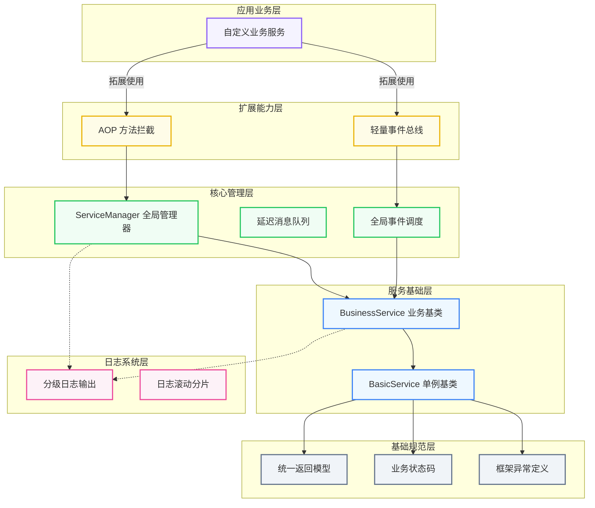

# NeoFrameworkLite

**NeoFrameworkLite** 是一款**零依赖、轻量级、线程安全**的 C\# 模块化业务服务框架。

专为 **小型业务、游戏服务、工具宿主、模块化解耦项目** 设计，提供服务托管、动态反射调用、AOP 拦截、事件总线、分级日志、统一返回模型全套能力。

框架追求：**极简、轻量、无第三方依赖、可直接嵌入任意 \.NET 项目**。

---

## ✨ 核心特性

- **零第三方依赖**：纯原生 \.NET 实现，开箱即用

- **模块化服务架构**：统一服务生命周期（初始化/创建/释放）

- **动态消息调用**：支持服务名\+方法名字符串动态调用

- **内置 AOP 过滤器**：基于 Attribute 实现方法拦截、权限校验

- **内置事件总线**：服务级事件订阅发布，支持延迟挂载

- **智能消息队列**：服务未就绪自动暂存，注册后自动补发

- **高性能反射缓存**：全局缓存方法元数据，消除重复反射开销

- **全场景线程安全**：并发集合\+锁机制覆盖核心逻辑

- **分级异步日志**：Debug/Info/Warn/Error，支持文件滚动分片

- **统一业务返回规范**：标准化状态码与返回结构体

---

## 🏗 整体架构

框架采用**五层分层架构**，职责隔离、单向依赖、结构清晰：

### 1\. 基础规范层

全局统一约束与基础定义，为全框架提供统一标准。

- 统一返回模型：`ActionResult / ActionResult<T>`

- 业务状态枚举：`ActionState`

- 框架自定义异常：方法未找到、拦截异常、未初始化异常

- 通用服务根接口：`IService`

### 2\. 服务基础层

所有服务的顶层基类，统一管控生命周期。

- **BasicService\<T\>**：通用线程安全单例服务基类（基于 `Lazy<T>`）

- **BusinessService**：业务服务基类，提供反射调用、事件、AOP 过滤器能力

### 3\. 核心管理层

**ServiceManager** 全局唯一入口，负责所有服务调度与托管。

- 服务动态注册、卸载、生命周期调度

- 同步/异步消息方法调用

- 服务未就绪消息延迟队列与自动补发

- 全局事件分发、资源统一释放回收

### 4\. 扩展能力层

框架增强能力，用于拓展业务逻辑。

- **ActionFilterAttribute**：AOP 方法拦截特性，用于权限、状态校验

- **FrameworkEvent / FrameworkEventTable**：内置轻量事件总线

### 5\. 日志系统层

内置高性能异步日志组件，无需第三方日志库。

- 四级分级日志：Debug / Info / Warn / Error

- 控制台实时输出 \+ 本地文件持久化

- 按日期/文件大小自动滚动分片

- 异常堆栈自动格式化、全局开关可控
  
### 📐 框架层级架构示意图

以下为 GitHub 原生可直接渲染的架构分层图，展示完整层级依赖关系：



---

## 📦 安装与引入

项目无任何第三方依赖，纯原生 \.NET 代码，直接引入源码即可使用。

**跨平台支持**：\.NET Framework / \.NET Core / \.NET5\+ / Unity

---

## 🚀 快速上手

### 1\. 定义自定义业务服务

```csharp
public class DemoService : BusinessService
{
    protected override void OnCreated(object[] args)
    {
        this.Info("DemoService 初始化完成");
    }

    public string Hello(string name)
    {
        return $"Hello {name}";
    }
}

```

### 2\. 框架初始化 \& 服务注册

```csharp
// 开启日志（按需开启）
FrameworkLiteEnvironment.LogEnabled = true;
FrameworkLiteEnvironment.SaveLogFile = true;

// 初始化全局框架
ServiceManager.Instance.Initialize(null);

// 注册自定义业务服务
ServiceManager.Instance.Register<DemoService>();

```

### 3\. 异步调用（推荐）

```csharp
var res = await ServiceManager.Instance.SendMessageAsync<string>("DemoService", "Hello", "NeoFramework");
Console.WriteLine(res.Content);

```

### 4\. 事件订阅监听

```csharp
var evt = ServiceManager.Instance.GetEvent("DemoService", "OnCreated");
evt.AddListener(s => Console.WriteLine("服务创建完成事件触发"));

```

### 5\. 程序退出资源释放

```csharp
ServiceManager.Instance.Release(null);
```

---

## 🛡 AOP 过滤器使用

通过自定义特性实现方法前置拦截，用于权限校验、状态拦截等场景：

```csharp
public class CheckAuthAttribute : ActionFilterAttribute
{
    public override bool CanExecute()
    {
        Message = "权限不足，禁止访问";
        return false; // 返回 false 拦截方法执行
    }
}

// 挂载到业务方法
public class DemoService : BusinessService
{
    [CheckAuth]
    public void SecureMethod()
    {
        // 被拦截后不会执行
    }
}

```

---

## 📊 业务状态码说明

|状态枚举|值|说明|
|---|---|---|
|Success|0|执行成功|
|Failed|100|业务逻辑执行失败|
|NotFound|101|目标方法未找到|
|Uninitialized|200|服务未初始化|
|Filtered|300|被 AOP 过滤器拦截|
|Exception|301|方法执行异常|
|Timeout|302|调用超时|
|NoCreated|400|服务未加载，消息已入队等待|

---

## ✅ 框架优势 \& 源码质量

本框架经过多轮重构与生产级问题修复，规避了大量简易框架的通病：

- **安全单例**：使用 \.NET 标准 `Lazy<T>`，彻底杜绝单例线程安全问题

- **全并发安全**：核心容器全部使用线程安全集合，适配高并发场景

- **反射性能优化**：全局方法缓存，避免频繁反射造成性能损耗

- **事件系统加固**：事件增删、调用加锁，解决竞态与监听丢失问题

- **规范异常处理**：无空吞异常，所有异常分级日志记录

- **安全异步模型**：全链路 `ConfigureAwait`，杜绝异步死锁

- **内存泄漏防护**：完整的 Dispose、防重复释放、资源回收机制

---

## 📌 开发约束与规范

- 所有自定义业务服务必须继承 **BusinessService**

- 禁止手动 `new` 服务实例，统一由 `ServiceManager` 托管创建

- 正式环境优先使用 **SendMessageAsync** 异步调用，规避死锁风险

- 程序退出/模块卸载必须调用 `ServiceManager.Instance.Release` 释放资源

---

## 📄 License

MIT License · 开源免费，可自由商用、二次开发与分发

